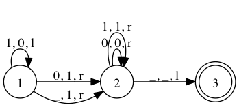

# turing-php

Turing machine emulator in PHP.

## Usage

You can run the machine as follows:

    $ bin/machine <file>

### `run`

The default mode is the `run` mode that runs until the machine reaches an
accept state at which point it halts and prints the current tape and
configuration.

    $ bin/machine examples/increment.php
    Tape: 110(0)
    Position: 3
    State: 3
    Steps: 6

You can also provide your own initial tape and start position with the `-t`
and `-p` options:

    $ bin/machine examples/increment.php -p 1 -t 10
    Tape: 1(1)
    Position: 1
    State: 3
    Steps: 2

Note that the rules may require you to provide a valid initial position.

### `debug`

If you want to get better information about what the machine is doing while
running, you can run it in debug mode. This will make it print the tape and
configuration after every transition. This can be useful when inspecting
non-terminating machines.

    $ bin/machine debug examples/increment.php
    Tape: 101(1)
    Position: 3
    State: 1
    --------
    ...
    --------
    Tape: 1100(_)
    Position: 4
    State: 2
    --------
    Tape: 110(0)
    Position: 3
    State: 3
    Steps: 6

### `until <n>`

For potentially non-terminating machines, the until mode allows the maximum
number of steps to be limited. If that number of steps is exceeded, an error
is returned.

    $ bin/machine until 10 examples/omega.php
    ERROR: Exceeded maximum steps of '10'.

### `graphviz`

You can dump the rules to the graphviz format and then feed that into `dot` to
get a pretty graphical representation of the state transitions.

    $ bin/machine graphviz examples/increment.php | dot -Tpng -o doc/increment.png

Output:

## References

* [Alan Turing: On computable numbers, with an application to the Enscheidungsproblem](http://classes.soe.ucsc.edu/cmps210/Winter11/Papers/turing-1936.pdf)
* [Charles Petzold: The Annotated Turing](http://www.charlespetzold.com/annotatedturing/)
* [Tom Stuart: Understanding Computation](http://computationbook.com/)
* [Paul Rendell: Game of Life UTM](http://rendell-attic.org/gol/utm/utmprog.htm)
* [Universal Turing Machine implemented in Minecraft](https://www.youtube.com/watch?v=1X21HQphy6I)
* [Turing Machine - Wikipedia](http://en.wikipedia.org/wiki/Turing_machine)
* [Universal Turing Machine - Wikipedia](http://en.wikipedia.org/wiki/Universal_Turing_machine)
